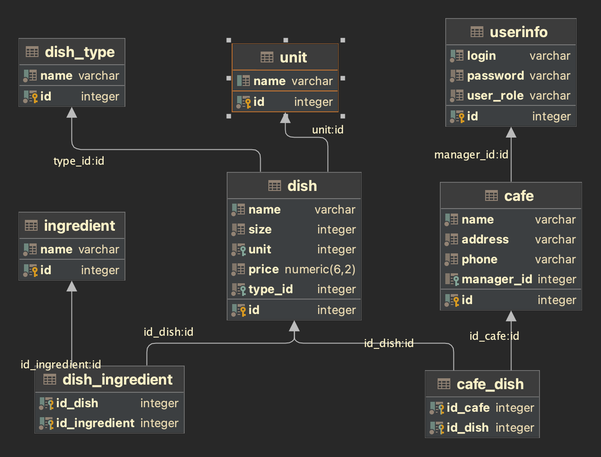

## Café Backoffice Management App
#### Spring MVC Test Project with Thymeleaf templates and Security.

The Café project functionality includes the ability to create, read, update, and delete (CRUD) records in the database.
The functionality is secured by requiring a login and a password to access these features.

The system stores lists of cafés, dishes, dishes types, ingredients, measurement units and users. 
Users with role **admin** can maintain all available operations like add, edit and delete all entities including users. 
Users with role **global_manager** can add, edit and delete cafés, dishes, dishes types, ingredients, measurement units, 
set or change managers of cafés.
Users with role **cafe_manager** can maintain only cafés (except deleting them), to which they're assigned.

### Technologies used:
- Java 17
- Maven
- PostrgeSQL and H2(for testing) databases
- Spring Boot
- Spring Data JPA and Hibernate
- Spring Security
- Thymeleaf templates
- Bootstrap for frontend UI
- Lombok
- JUnit, Mockito and AssertJ for some tests

### How to run the app:
1. Setup PostgreSQL DB
2. Clone the repository
3. Rename file .env.sample to .env
4. Set in .env file password for Postgres
5. mvn clean install -DskipTests to build project with tests skipping
6. Run
7. Access URL: http://localhost:8080/

### Roles:
#### admin
- login: admin
- password: admin

#### global_manager
- login: global_manager
- password: global_manager

#### cafe_manager
- login: cafe_manager1
- password: cafe_manager1

- login: cafe_manager2
- password: cafe_manager2

- login: cafe_manager3
- password: cafe_manager3

### Database ERD
